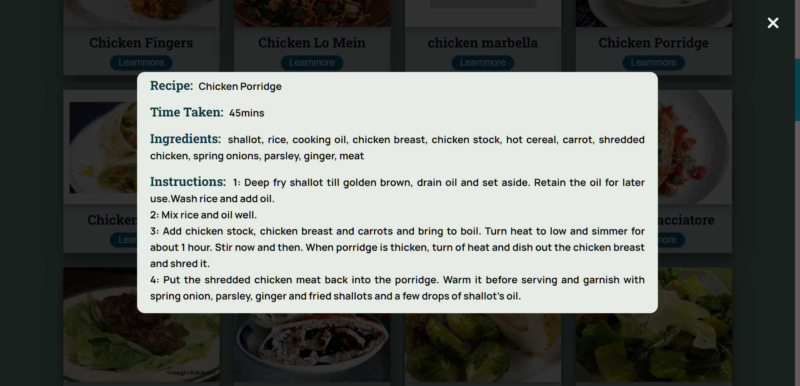

# Food Recipe App

RecipeMate is a food recipe app that uses Spoonacular API to fetch recipe items. This Website consists of home page that displays a carousel of recipe images. Users can choose the type of meal from the menu or can use search bar that allows to search for recipe by food item. When a user enters a food item in the search bar, the app will return a list of recipes that match the search criteria. The website will display these recipes on the results page.

The recipe items are displayed in cards. Each card consists of an image of the recipe, the recipe name, and a "Learn more" button. When a user clicks on the "Learn more" button, a popup will show the "recipe details", such as the recipe name, ingredients, instructions, time taken to complete, and servings.

## Demo

Watch the demo video on [YouTube](https://youtu.be/R9D5XZF07qE).

## Tech Stack

**Front End :** HTML, CSS, JavaScript

**IDE:** Visual Studio Code
